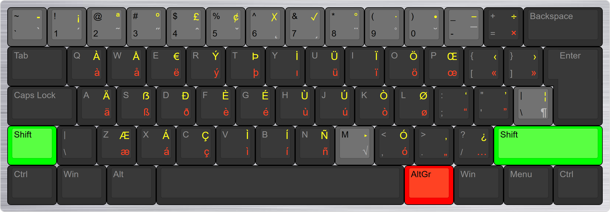
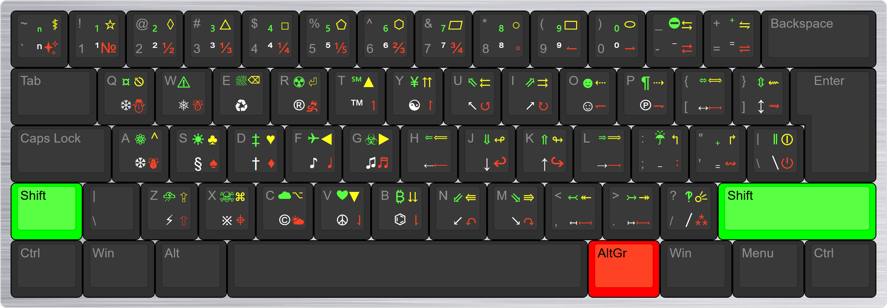

# EurKEY Ultra—Multilingual European and Symbolic Keyboard Layout

EurKEY Ultra is a keyboard layout based off of EurKEY 1.3 beta by Steffen Brüntjen. At first, I was just looking for a keyboard to type German characters ä, ü, ö, and ß without having to use the Windows emoji picker menu. I tried the US international keyboard layout built into Windows and hated it because of the way it handles the quote and grave keys. Then I found EurKEY, which is a lot better because it doesn't change the way basic keys work and also has access to more symbols than the standard US international keyboard. EurKEY is a great layout, but I felt like there were some mistakes and missed opportunities in it. This got me interested in the idea of multilingual typing and led me to a quest to find the ultimate European keyboard. I also knew about Eumak, but that's only available for Linux. Before I started this project, I couldn't find another layout that covers most European languages, so I decided to try making one. (But later I did find other layouts; see the "Alternatives to EurKEY Ultra" section at the end.) The first version took a few days to make, and then I kept making changes and adding more letters and other symbols over the course of a few weeks. I used KbdEdit Premium to make this layout and used the MSKLC file for EurKEY 1.3 beta available on the "EurKEY Keyboard Layouts - Clone Project" page on GitHub as a base. EurKEY Ultra was made for fun as an experiment.

Note: I don't publish a separate version every time I make a small change. For some of the bigger changes I made, I released them as separate "old" versions. These old versions are included for archival and for curiosity. If you want to make sure you have the latest version, check the date of the v1.0 release.

# Layout Enhancements and Changes

EurKEY Ultra adds many characters that are missing in EurKEY. Some of these include:

* Full Greek keyboard, with tonos, dialytika, and combined accents
* Hungarian double acute letters ő and ű
* Breve accent, for letters like ă and ŭ
* Romanian comma-below support for ț and ș
* Turkish dotless ı and capital dotted İ
* Support for minority languages like Sámi, Welsh, Romani, Sorbian, Resian, Livonian, and many others
* Esperanto is also fully supported
* Type over 300 symbols, including over 150 math symbols like ∃ ℤ ∇ ∀, over 60 arrows like ⇗ ⟼ ⇚ ↫, and over 150 other symbols like ¤ ₿ † ‡ and ⛈ ⛔ ❄ ☯ ⚡ (some of these might render as emojis, depending on the font/app)

I tested this keyboard layout with typing tests on several websites, like monkeytype.com, keyhero.com, 10fastfingers.com, free-online-writing.com, and quicktypingtest.com. I tried typing words and passages in Spanish, French, German, Norwegian, Icelandic, Hungarian, Polish, Slovak, Czech, Latvian, Lithuanian, Romanian, Turkish, Greek, and many others. For all the Latin-based European languages available on those typing test sites, I tested them several times each. I was able to get about 30–40 WPM for every language tested (except Greek, where I can only get about 25 WPM because I'm not as familiar with that layout). You could probably do it much faster with practice. I also tested writing equations using https://latexeditor.lagrida.com/. This layout supports many math symbols that are in LaTeX and Amssymb.

Some things are the same as on EurKEY, but there are many differences. I didn't keep track of every change I made, but here are some of them:

* More dead keys, different dead key positions
* Easier access to letters with ogonek, like ą and ę, for Polish and Lithuanian
* Letters like ř and š for Czech and Slovak can be typed using fewer keystrokes than EurKEY
* Restored the functionality of ð (eth) to `AltGr` + `D` for Icelandic support. The letter đ can still be typed using the macron dead key
* Moved æ back to `AltGr` + `Z` to match the US international keyboard layout
* Made `AltGr` + `Shift` + `E` the Euro sign
* The º and ª for Spanish ordinals are typed using `AltGr` + `Shift` + `2` and `AltGr` + `Shift` + `3`, instead of `AltGr` + `2` and `AltGr` + `3`
* Moved the German lower-99 quotation mark „ symbol to `AltGr` + `.` instead of `AltGr` + `8`. The left and right double-quote keys are also in different positions
* Rearranged a few Greek symbols and added final sigma ς to follow the standard Greek layout
* Rearranged some of the existing math symbols. The math layer is also now on `AltGr` + `M` instead of `AltGr` + `Shift` + `M` (one key less)
* Subscript and superscript numbers were moved to the misc. symbols layer
* Fractions are typed by holding down `AltGr` in the misc. symbols layer. For example, `AltGr` + `\` + `2` → ½ (or `AltGr` + `\`, `AltGr` + `2`)

# Installation

On Windows, a standalone installation exe is included if you just want to install and use the layout. A .kbe file is included that you can use to import the layout into KbdEdit if you want to make your own customizations. On Mac, follow the "Installing exported layouts on a Mac" directions on http://www.kbdedit.com/manual/file_export_mac_keylayout_file.html. See the disclaimer below about Mac support though.

# Layout

## Base Layer

## Greek Keyboard—`Caps Lock`

## Math Symbols—`AltGr` + `M`

## Misc. Symbols—`AltGr` + `\`

# How to Use This Keyboard Layout

This keyboard layout uses **dead keys** to type symbols and accented letters. The layout is divided into layers and sublayers. If you aren't trying to type special characters, the keyboard will just work like a regular US QWERTY keyboard, except for the `Caps Lock` key, which switches to Greek letters. The other layers are accessed with the `AltGr` (Right `Alt`) key or `Option` on macOS. The dead keys are highlighted in gray in the screenshots. Many letters used in Western European languages can be typed without using any dead keys. You can just use `AltGr` + base QWERTY keys to type characters that are commonly used in many languages, such as `AltGr` + `A` → ä, `AltGr` + `G` → é. Circumflex letters like ê â ô for French and tilde letters ã õ for Portuguese have to be typed with dead keys.

The symbols in the diagrams are color coded:

* ⚪ White symbols (bottom left) require no modifier
* 🟢 Green symbols (top left) are typed with `Shift`
* 🔴 Red symbols (bottom right) are typed with `AltGr`
* 🟡 Yellow symbols (top right) are typed with `AltGr` and `Shift` held together
* The gray symbols activate the dead keys

Typing symbols involves two steps. First, press `AltGr` together with a gray key to enter one of the main layers. After that, to type an accented letter, press the base letter that takes the accent. For math and misc. symbols, press a combination of one, two, or three keys to type the symbol shown. Accented letters are typed with `AltGr` and keys on the top row, the math layer is on `AltGr` + `M`, and the miscellaneous symbols layer is on `AltGr` + `\`. The physical placement of the `\` will depend on your keyboard, but will be near the `Enter` key. In these instructions, a **+** (plus sign) means two keys should be pressed at the same time, and a **,** (comma) means letting go of all the keys. For example, a key sequence like `AltGr` + `2`, `Shift` + `O` → Õ should be interpreted as "press `AltGr` and `2` together, let go of both keys, and then press `Shift` and `O` together." The capital version of any letter can be made by adding `Shift` before the last key, such as `AltGr` + `0`, `Shift` + `A` → Ă.

The math and misc. symbols layer each has four sublayers: the base layer (no modifier), `Shift`, `AltGr`, and `Shift` + `AltGr`. To see which symbols can be typed, and how to type them, follow the screenshots. For example, to type the ∈ symbol on the math layer, press `AltGr` + `M` together, which enters the math layer. Then let go of both keys, and press `K`. To type ∯, press `AltGr` + `M`, then `AltGr` + `2`. To type ⌘ on the misc. symbols layer, press `AltGr` + `\`, and then `AltGr` + `Shift` + `X`. If a key combination has `AltGr` twice in it, you could keep holding `AltGr`. In that case, for ∯ you could press `AltGr` + `M`, then let go of `M` but keep holding `AltGr`, then press `2`, and for ⌘ you could press `AltGr` + `\`, then let go of only `\` and press `Shift` + `X`.

For math and miscellaneous symbols, most of the symbols either resemble the shape of the letter used to type them, or the symbol's name starts with the last letter used to type it. For example, `AltGr` + `M`, `Shift` + `S` → ∫ (integral sign, shaped like an S), or `AltGr` + `M`, `P` → ∂ (partial derivative symbol, name starts with a P). Understanding the symbol placement is like understanding the dynamics of high school culture. In high school, everyone belongs to a niche. There are jocks, nerds, goths, cheerleaders, and so on. In this keyboard layout, similar symbols go together too, either by being next to each other, being on the same sublayer, or being on the same key. For example, the set-relation symbols are on `G`, `H`, and `B`, and the weather symbols are mostly capital letters that represent the start of the name, like `Shift` + `S` for ☀ and `Shift` + `C` for ☁. For math symbols, the most common ones are usually typed without `Shift` or `AltGr` after the dead key, like ∃ ∞ ∧ ∘ ∅ ∛. In the analogy, these are the popular symbols. Everyone is asking them out to the big dance. `Shift` is also used to type some common symbols, like ∀ ℤ ∫ ⊕ and some rarer symbols like ∮ ℘ ⊻ ∬. Most of the symbols on the `AltGr` and `AltGr` + `Shift` sublayers, like ⊞ ⋓ ⨖, are the rarest ones.

## Visual Mnemonic for Accents

This keyboard layout uses a system of twelve keys to type accented characters. The number keys are used here becase they are in the same place on most keyboard layouts. The key to the left of `1` is used, which sometimes has a `0` printed on it, but usually something else, depending on the region. The key to the right of `0` is also used, which usually has a hyphen minus on it. In order to understand which accents correspond to which number, you have to look at the shape of that number. Here's how to visualize the dead-key system:

* `AltGr` + `ˋ` → Grave. Has a grave symbol printed on some keyboards. Next to the `1` key, which is used for acute. Example letters: è, ì, à
* `AltGr` + `1` → Acute. The top of the number 1 looks like an acute accent. Example letters: ó, í, ú, also έ, ά, ώ (Greek tonos)
* `AltGr` + `2` → Tilde. The number 2, rotated sideways, looks like a tilde symbol. Example letters: ã, õ
* `AltGr` + `3` → Double acute. The numeral 3 has two "hooks" that look like a double acute when the number is turned sideways. Example letters: ő, ű, also ΰ, ΐ (Greek combined diacritics)
* `AltGr` + `4` → Circumflex. The top of the number 4 looks like a circumflex. Example letters: ô, â, î
* `AltGr` + `5` → Caron. The bottom curve of the number 5 represents a caron. Example letters: š, ž, ř
* `AltGr` + `6` → Ogonek and Cedilla. The bottom loop of the number 6 can represent either an ogonek or cedilla (both are combined into the same key). Example letters: ę, ą, ų (ogonek), ş, ç (cedilla), also ŋ, ʒ
* `AltGr` + `7` → Comma below. The diagonal line of the number 7 goes in the same direction as the comma below. Example letters: ș, ț, ķ*
* `AltGr` + `8` → Diaeresis (Umlaut). The letter 8 has two circles that look like two dots when turned sideways. Example letters: ä, ü, ë, also ϋ, ϊ (Greek dialytica)
* `AltGr` + `9` → Dot and ring above. The top loop of the 9 represents a dot or ring (both are combined into the same key). Example letters: ż, ė, ů
* `AltGr` + `0` → Breve. The bottom of the number 0 is curved like a breve. Example letters: ă, ŭ, ğ
* `AltGr` + `-` → Macron. Has a hyphen minus printed on some keyboards. The line represents a macron. Example letters: ō, ī, ā, also ł, đ, ħ, ŧ, ǥ

Note:

*Some letters, like ķ, should be rendered with a comma below, but Unicode labels them as having cedillas. Despite Unicode's incorrect labeling, these letters are included in the dead key for comma below to match their actual function.

A few letters used in Livonian have two stacked accent marks. All of them have a macron on top. To type them, first use the dead key for the bottom accent, then use `AltGr` with the base letter to add the macron on top. These are the key sequences:

* `AltGr` + `8`, `AltGr` + `A` → ǟ
* `AltGr` + `2`, `AltGr` + `O` → ȭ
* `AltGr` + `9`, `AltGr` + `O` → ȱ

There are several dashes and spaces included as part of the macron dead key:

* `AltGr` + `-`, `1` → ‐ (hyphen)
* `AltGr` + `-`, `2` → – (en dash)
* `AltGr` + `-`, `3` → — (em dash)
* `AltGr` + `-`, `9` → no-break space
* `AltGr` + `-`, `0` → narrow no-break space
* `AltGr` + `-`, `Shift` + `9` → thin space
* `AltGr` + `-`, `Shift` + `0` → zero-width space
* `AltGr` + `-`, `AltGr` + `9` → hair space
* `AltGr` + `-`, `AltGr` + `0` → word joiner
* `AltGr` + `-`, `-` → ‑ (non-breaking hyphen)
* `AltGr` + `-`, `Shift` + `-` → soft hyphen
* `AltGr` + `-`, `=` → ‒ (figure dash)
* `AltGr` + `-`, `Shift` + `=` → figure space
* `AltGr` + `-`, `,` → invisible separator
* `AltGr` + `-`, `.` → invisible times
* `AltGr` + `-`, `/` → invisible plus

The ring/dot above dead key has a few modifier letters:

* `AltGr` + `9`, `'` → ʼ modifier letter apostrophe (Võro)
* `AltGr` + `9`, `Shift` + `'` → ʹ modifier letter prime (soft sign in ISO 9 Cyrillic transliteration, Skolt Sámi)
* `AltGr` + `9`, `AltGr` + `'` → ʺ modifier letter double prime (hard sign in ISO 9 Cyrillic transliteration)

# Limitations of EurKEY Ultra

* An `AltGr` (Right `Alt`) key is required to use the layout on Windows, which some keyboards may not have. If your keyboard doesn't have one, you can use KeyTweak or similar to re-assign another key that you don't use for anything to be `AltGr`
* The macOS version of EurKEY Ultra is untested. There's a .keylayout file for Mac, but I can't guarantee it works because I don't have a Mac to test anything. If the .keylayout file generated by KbdEdit doesn't work, then a version will probably have to be remade with a tool like Ukelele
* This keyboard layout won't fit everyone's preferences. Some people won't like the placement of the symbols, or some people won't like using dead keys to type accents, for example. A keyboard is a tool, so you should use whatever system works best for you
* The keyboard layout is designed with US QWERTY layout in mind. If you're not using a US QWERTY keyboard, this layout will still work, but note that some letters and symbols won't visually make sense to what's printed on your keycaps. Almost all of the accents are typed using the number keys, at least, which are the same on most keyboards
* Although I tried to include and test every European language I could find that uses a Latin script, I probably missed some characters somewhere. I can't guarantee support for every minority language, but most European languages should be covered, as well as all official EU languages except Bulgarian. Languages that use Cyrillic characters won't work in general on this layout. If I missed any other letter that's used in a modern European alphabet, let me know, and I'll add it if I can
* The Caps Lock key is repurposed to type Greek. You can still type in all caps using the `Shift` key

# Alternatives to EurKEY Ultra

If you decide EurKEY Ultra isn't for you, here are some other alternatives worth looking at. These support multilingual European typing, math symbols, or both:

* **Kreative SuperLatin Keyboard Layout**
  * For Winodws, macOS, and Linux. Can type all of the most commonly used accented letters. The website also include a SuperCyrillic keyboard, and others
  * https://www.kreativekorp.com/software/keyboards/superlatin/

* **US English keyboard with all Latin accents using chained dead keys**
  * For Windows. An example layout from KbdEdit's website. Has 26 accents and supports stacking diacritics
  * https://www.kbdedit.com/manual/ex18_latin_all_accents_chained_dead.html

* **US International Scientific Keyboard Layout**
  * For Windows. Includes many commonly used diacritics and tons of math symbols
  * https://github.com/BelugaHaechi/US-International-Scientific-Keyboard

* **kbdLayout-Mac**
  * macOS only. Has 26 accents, with the ability to stack diacritics, and many math symbols. Has both Russian and English versions
  * https://github.com/eugenesvk/kbdLayout-Mac

* **Math Keyboard layout for QWERTY keyboards on Windows**
  * For Windows. Can type many common math symbols
  * https://www.jkorpela.fi/math/kbd.html

* **Neo**
  * For Windows, macOS, and Linux. Optimized for German, but supports many languages and math symbols
  * https://neo-layout.org/

* **BÉPO**
  * For Windows, macOS, and Linux. Optimized for French, but supports all Latin-based EU languages, Greek, and Esperanto
  * https://bepo.fr/wiki/Accueil

* **Eumak**
  * Linux only. Supports many European languages
  * https://eumak.org/

* **SmartLayer**
  * Linux only. Has many common accented letters and math symbols
  * https://github.com/SmartLayer/SmartLayer?tab=readme-ov-file

* XKB Math-Layout
  * Linux only. Based on German QWERTZ layout. Supports some common math symbols and Greek letters
  * https://github.com/SV-97/Math-Layout
