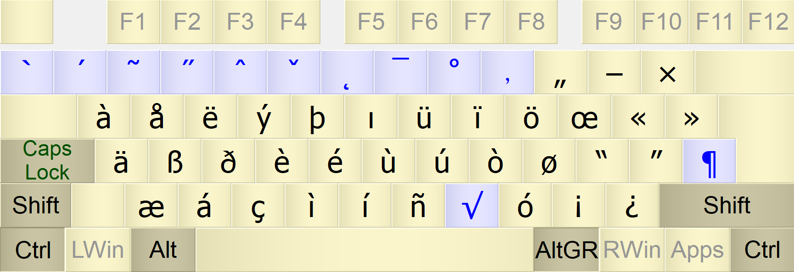
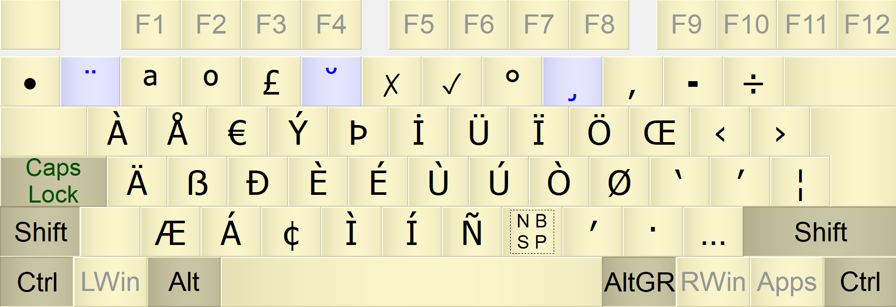
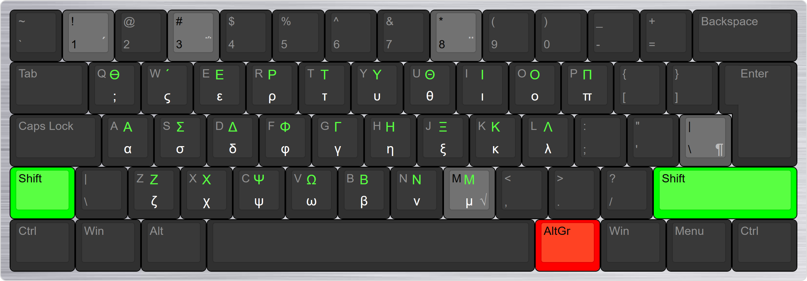
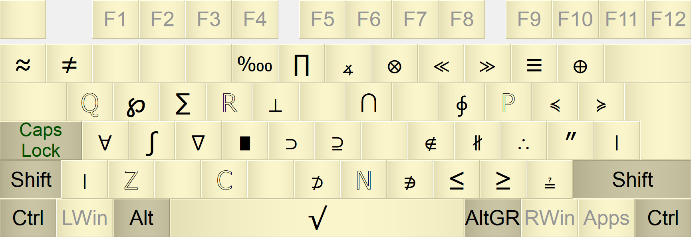
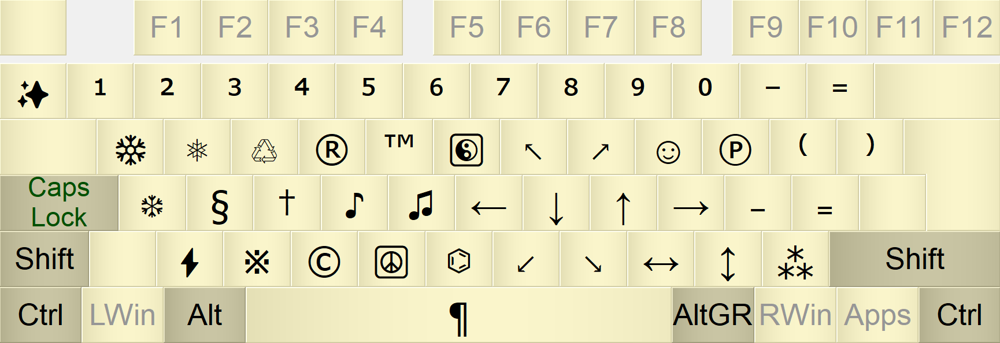
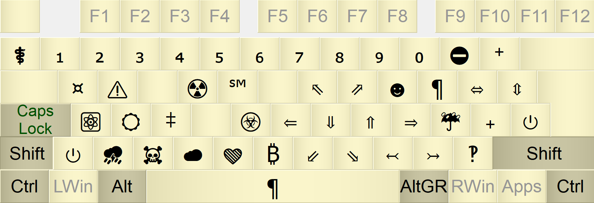
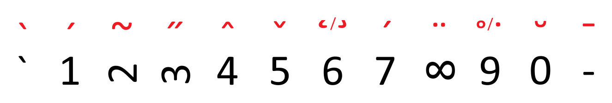
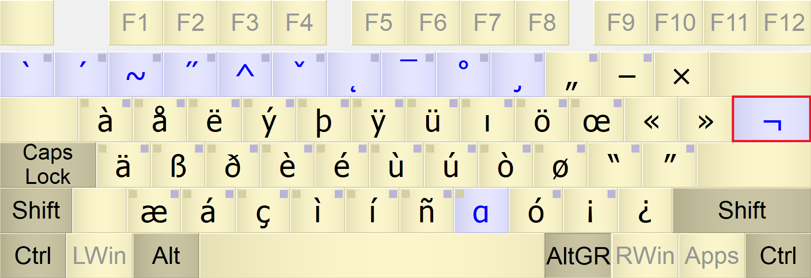
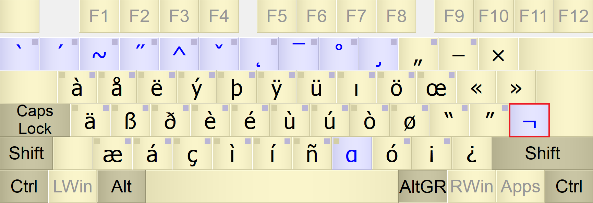
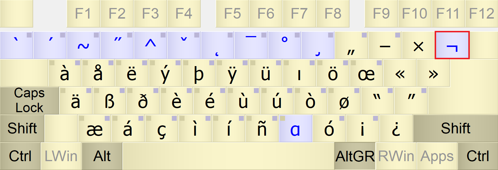

# EurKEY Ultra—Multilingual European and Symbolic Keyboard Layout

EurKEY Ultra is a keyboard layout based off of EurKEY 1.3 beta by Steffen Brüntjen. At first, I was just looking for a keyboard to type German characters ä, ü, ö, and ß without having to use the Windows emoji picker menu. I tried the US international keyboard layout built into Windows and hated it because of the way it handles the quote and grave keys. Then I found EurKEY, which is a lot better because it doesn't get in your way and also has access to more symbols than the standard US international keyboard. EurKEY is a great layout, but I felt like there were some mistakes and missed opportunities in it. This got me interested in the idea of multilingual typing and led me to a quest to find the ultimate European keyboard. There's also Eumak, but that's only available for Linux. I saw there wasn't another keyboard out there that could type most European languages that use Latin-based characters, so I decided to try making one, which took a few days. I used KbdEdit Premium to make this layout and used the MSKLC file for EurKEY 1.3 beta available on the EurKEY Keyboard Layouts - Clone Project on GitHub as a base. EurKEY Ultra was made for fun as an experiment.

# Language Enhancements

EurKEY Ultra adds many characters that are missing in EurKEY. Some of these include:

* Hungarian double acute letters ő and ű
* Breve accent, such as ă and ŭ
* Romanian comma-below support for ț and ș
* Turkish dotless ı and capital dotted İ
* Easier access to letters with ogonek, like ą and ę, for Polish and Lithuanian
* Letters like ř and š for Czech and Slovak can also be typed using fewer keystrokes than EurKEY.

This version of the layout adds more dead keys, but most letters can be typed in only 3 keystrokes. For example, to type ř, you use AltGr + 5, and then hit the r key. I tested this keyboard layout with typing tests on several websites, like keyhero.com, 10fastfingers.com, free-online-writing.com, and quicktypingtest.com. I tried typing words and passages in Spanish, French, German, Norwegian, Icelandic, Hungarian, Polish, Slovak, Czech, Latvian, Lithuanian, Romanian, Turkish, and many others. Esperanto is also fully supported. For basically all the Latin-based scripts available on those typing test sites, I tested them several times each. I was able to get about 30–40 WPM for pretty much every language I tested, which may seem pretty slow, but you could probably do it much faster with practice. 

# Installation

A standalone installation exe is included if you just want to install and use the layout. A .kbe file is included that you can use to import the layout into KbdEdit if you want to make your own customizations.

# Layout

## Language Characters

### AltGr Layer

### AltGr + Shift Layer

## Greek Symbols for Math—AltGr + m

## Math Symbols—AltGr + Shift + M

### Without Shift Key

### With Shift Key

## Misc. Symbols

### Without Shift Key

### With Shift Key

# Visual Mnemonic for Accents

This keyboard layout uses a system of ten keys to type accented characters. The number keys are used becase they are in the same place on most keyboard layouts. The key to the left of 1 is also used, which is sometimes a 0, but usually something else, depending on the region. In order to understand which accents correspond to which number, you have to look at the shape of that number. Here's how to visualize the dead-key system:

* AltGr + [key left of 1] → Grave¹. No visual mnemonic. Just remember it's next to the 1 key, which is used for acute. Examples: è, ì, à
* AltGr + 1 → Acute¹. The top of the number 1 looks like an acute accent. Examples: ó, í, ú, also ł
* AltGr + 2 → Tilde. The number 2, rotated sideways, looks like a tilde symbol. Examples: ã, õ
* AltGr + 3 → Double acute accent for Hungarian. The numeral 3 has two "hooks" that look like a double acute when the number is turned sideways. Examples: ő, ű
* AltGr + 4 → Circumflex. The top of the number 4 looks like a circumflex. Examples: ô, â, î
* AltGr + 5 → Caron and breve. The bottom curve of the number 5 looks like a caron or breve (both are combined into the same key). Examples: š, ž, ř (caron) and ă, ŭ, ğ (breve)
* AltGr + 6 → Ogonek. The number 6 looks like an ogonek. Examples: ę, ą, ų
* AltGr + 7 → Macron. The line on the top of the 7 represents a macron. Examples: ō, ī, ā, also ħ, ŧ, also ‐, –, — (hyphen, en dash, em dash)
* AltGr + 8 → Dot and ring above. The top loop of the 8 represents a dot or ring (both are combined into the same key). Examples: ż, ė, ů
* AltGr + 9 → Cedilla. The number 9 looks like a cedilla. Examples: ş, ç, ķ, ņ²
* AltGr + Shift + 1 → Diaeresis (umlaut)¹. Follows the same convention as the US international layout by being paired with the acute key. Examples: ä, ü, ë
* AltGr + Shift + 9 → Comma below for Romanian. The number 9 also visually looks like a comma. Examples: ș, ț, also ŋ

Notes:

¹There are quicker shortcut keys to access common acute, grave, and double-dot letters, such as AltGr + a for ä or AltGr + g for é (on a QWERTY layout). The dead keys are included as a backup

²Some letters, like ķ and ņ, actually have commas below, but Unicode mislabels them as having cedillas. They are still included in the cedilla category to follow this naming convention.

# The Location of the Misc. Symbols Key

Due to differences between ISO and ANSI layouts, the location of the "Misc. Symbols" dead key will be different on different keyboards. Press AltGr with the highlighted key to get to these symbols. Here's a visual representation of where the key is on different boards:

## ANSI

## ISO

## ISO Variant

# Changes between EurKEY and EurKEY Ultra

Some things are the same as on EurKEY, but there are many small differences. I didn't keep track of every change I made, but here are some of them:

* Restored the functionality of ð (eth) to AltGr + d for Icelandic support. The letter đ can still be typed using the macron dead key
* Moved æ back to AltGr + z to match the US international keyboard layout
* Made AltGr + Shift + E the Euro sign, and AltGr + Shift + Y the Yen sign
* Added a Bitcoin ₿ and generic currency sign ¤ to the misc. symbols layer
* The º and ª for Spanish ordinals are typed using AltGr + Shift + 2 and AltGr + Shift + 3, instead of AltGr + 2 and AltGr + 3
* Moved the German lower-99 quotation mark „ symbol to AltGr + 0 instead of AltGr + 8 because of the new dead key on AltGr + 8. The left and right double-quote keys are also in different positions
* Rearranged a few Greek symbols to follow the standard Greek layout
* Rearranged some of the math symbols, and added many new math symbols
* Added variants of several Greek symbols ϵ, ϱ, ϖ, ϕ, and ϑ which are sometimes used in math. To type them, hold the AltGr key while typing the base Greek symbol. For example, AltGr + m + e → ϵ (or AltGr + m, AltGr + e)  
* And many other changes

# Limitations of EurKEY Ultra

* This keyboard layout won't fit everyone's preferences. Some people won't like the placement of the keys, or some people won't like using dead keys to type accents, for example. A keyboard is a tool, so you should use whatever system works best for you
* The keyboard layout is designed with US QWERTY layout in mind. If you're not using a US QWERTY keyboard, this layout will still work, but note that some letters and symbols won't visually make sense to what's printed on your keycaps. All of the accents are typed using the number keys, at least, which are the same on most keyboards
* Although I tried to include and test every European language I could find that uses a Latin script, I probably missed some characters somewhere. I can't guarantee support for every minority language, but most European languages should be covered, as well as all official EU languages except Bulgarian and Greek. EurKEY Ultra only includes the basic Greek alphabet, but no tonos. The Greek symbols are mostly useful for math and superscript and subscript numbers. It would be impractical to write Greek on this layout anyway, since it takes three key presses to type each letter. Languages that use cyrillic characters also won't work
* The Greek symbols are from the language block in Unicode, not the Mathematical Alphanumeric Symbols block. It's not possible to add symbols outside of Unicode's Basic Multilingual Plane to Windows keyboard layouts. Keep this in mind if that matters for your situation
